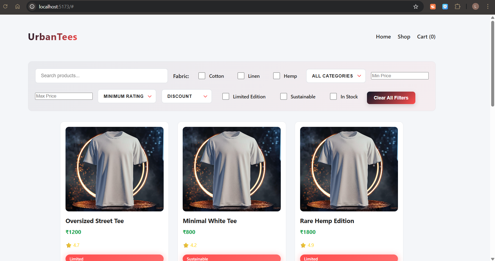
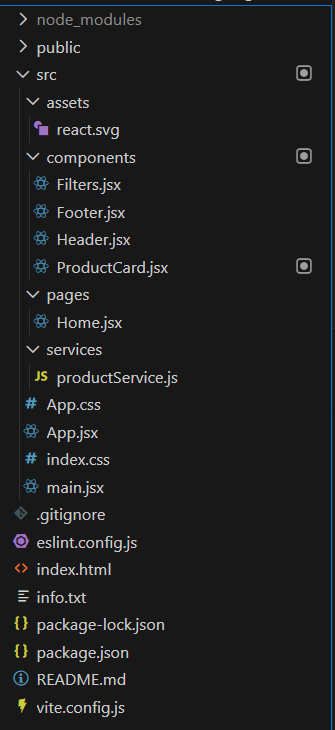

# 👕 UrbanTees  
### Modern Fashion eCommerce UI Built With React

> A sleek, scalable, filter-driven shopping experience for modern streetwear.

---

  

---

## 🚀 Overview

**UrbanTees** is a modern, component-driven eCommerce frontend built using React and Vite.  
It delivers a dynamic filtering system, responsive UI, and scalable architecture designed to easily integrate with cloud backends in the future.

Built with clean code principles and production-ready structure.

---

## ✨ Core Features

### 🛍 Smart Product Discovery
- Live Search
- Multi-condition Filtering
- Dynamic Sorting

### 🎯 Advanced Filters
- Fabric Selection (Cotton, Linen, Hemp)
- Price Range (Min / Max)
- Minimum Rating
- Discount Filter
- Limited Edition Toggle
- Sustainable Toggle
- In Stock Filter
- Category Dropdown

### 📊 Sorting System
- Price: Low → High
- Price: High → Low
- Highest Rating

### 🎨 UI/UX
- Clean minimal design
- Modern layout
- Responsive grid system
- Professional filter panel

---

## 🧠 Architecture Philosophy

UrbanTees is built with scalability in mind.

Current Data Source:
- Local `products.json`

Future Upgrade Path:
- REST API integration
- Firebase
- Node + Express backend
- MongoDB Atlas
- Full cloud deployment

Switching to backend requires minimal structural changes.

---

## 🛠 Tech Stack

| Technology | Purpose |
|------------|----------|
| React | UI Framework |
| Vite | Lightning-fast bundler |
| JavaScript (ES6+) | Core logic |
| CSS3 | Styling |
| JSON | Local data source |

---

## 📂 Project Structure

  

